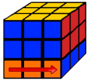
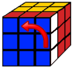
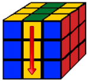
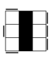
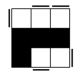
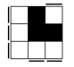
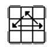

# Méthode Fridrich : accessible à tous

---

## Méthode Fridrich : sommaire

- Introduction à la méthode

  - Présentation de la méthode
  - Présentation du **langage universel**
  - Astuces et conseils pour l'apprentissage

- Méthode complète

  - La **croix** parfaite
  - Les **41** F2L (First Two Layers)
  - Les **57** OLL (Orientation Last Layer)
  - Les **21** PLL (Permutation Last Layer)

---

## Méthode Fridrich : qu'est-ce la méthode CFOP ?

> La méthode créée par **Jessica Fridrich** autrement appelé la méthode CFOP (Cross F2L OLL PLL) est une technique de résolution du Rubik's Cube 3x3x3 très rapide et souvent utilisée par les champions lors des compétitions.  
> Cette méthode ne nécessite pas la moindre "grande intelligence", les seules qualités requises sont le **temps** ainsi que la **patience**. Il n’est pas nécessaire d’avoir une bonne mémoire tant que vous **pratiquez** régulièrement !

Le but est de résoudre le Rubik's Cube en 4 étapes, soit la croix et 6 algorithmes au maximum :

### Étape 1

| _____________________________ ||
|-|-|
|  | La **croix** (Cross) est résolue logiquement avec une moyenne de 8 mouvements en 2-3 secondes, pour arriver à la résoudre aussi rapidement il est nécessaire de bien connaître les couleurs de son cube et de beaucoup s'entraîner afin de préparer les mouvements à l'avance. Il n'y a pas vraiment d'algorithme à apprendre pour cette étape. |

---

||||
|-|-|-|
|  | **Méthode Fridrich : Qu'est-ce que la méthode CFOP ?** |  |

### Étape 2

| ____________________________ ||
|-|-|
|  | Les **F2L** (First Two Layers) sont l'étape la plus longue consistant à résoudre les *deux premiers étages*. Le but est de regrouper un coin et une arête complémentaires appartenant à la face de référence (dont la couleur est celle de la croix) puis de les placer en même temps.   Cette étape regroupe 41 algorithmes mais elle peut se faire logiquement pour certains. Il est cependant préférable d'apprendre les algorithmes de la méthode pour aller plus vite. |

### Étape 3

| ____________________________ ||
|-|-|
|  | Les **OLL** (Orientation Last Layer) sont l'étape consistant à orienter tous les cubes de la couleur de la dernière face sur celle-ci (la face opposée à la première face) afin qu'elle soit unicolore et qu'il ne reste plus que la troisième couronne à compléter. Cette étape regroupe 57 algorithmes. |

### Étape 4

| ______________________________ ||
|-|-|
|  | Les **PLL** (Permutation Last Layer) sont l'étape où l'on va permuter les coins et les arêtes de la troisième couronne afin de refaire le cube. Cette étape regroupe 21 algorithmes. |

---

## Méthode Fridrich : Le langage universel

> Dans le mondu du Rubik's Cube, le langage universel est très utile. Il permet à la fois d'écrire n'importe quel algorithme de façon très courte (une lettre par mouvement) et peut être compris par n'importe qui dans le monde utilisant une méthode avancée, ce qui permet de suivre toute sorte de tutoriel avancé en anglais. De plus ce langage est souvent utilisé dans les logiciels de modélisation tel que Cube Explorer (très utile pour chercher et tester des algorithmes).

Pour lire ce langage il faut connaître les choses suivantes :

- Une **lettre** correspond à une face (Front - Up - Right - Left - Down - Back), plus le M pour la tranche du Milieu

- Une **majuscule** signifie qu'il faut tourner la face dans le sens des aiguilles d'une montre. Une **apostrophe** correspond au mouvement inverse donc dans le sens inverse des aiguilles d'une montre et le chiffre **2** veut dire qu'il faut tourner deux fois la face (donc le sens n'a aucune importance)

- Une minuscule signifie qu'il faut tourner la face et la tranche du milieu dans le même sens

||||
|:-|:-:|-:|
|  | Si vous êtes perdu pas d'inquiétude, les exemples seront plus clairs ! |  |

---

||||
|-|-|-|
|  | **Méthode Fridrich : Le langage universel** |  |

|______________________||
|-|-|
|  | Afin de vous présenter le langage, nous allons mettre la face bleue devant nous avec la face jaune au dessus |

|||||
|:-:|:-:|:-:|:-:|
|  |  |  |  |
| R | R' | R2 | r |
|  |  |  |  |
| r' | r2 | L | L' |
|  |  |  |  |
| L2 | l | l' | l2 |

---

||||
|-|-|-|
|  | **Méthode Fridrich : Le langage universel** |  |

|||||
|:-:|:-:|:-:|:-:|
|  |  |  |  |
| U | U' | U2 | u |
|  |  |  |  |
| u' | u2 | D | D' |
|  |  |  |  |
| D2 | d | d' | d2 |
|  |  |  |  |
| F | F' | F2 | B |

---

||||
|-|-|-|
|  | **Méthode Fridrich : Le langage universel** |  |

||||
|:-:|:-:|:-:|
|  |  |  |
| B' | B2 | M |
|  |  |
| M' | M2 |

Je tiens à préciser que dans le réel langage universel, M et M' sont inversés et il y a d'autres mouvements qui ne sont pas utilisés dans les algorithmes de la méthode.

Il y a également les changements de points de vue à connaître pour lire les algorithmes, je les représente par une flèche indiquant la face de référence avant et après avoir changé de point de vue.  
Pour généraliser, FaceA → FaceB siginfie que l'on doit déplacer le cube (sans faire de mouvement) de façon à ce que la face "B" soit positionnée à la place de la face "A" qui est placée face à nous.

||||
|:-|:-:|-:|
|  | Si vous êtes perdu pas d'inquiétude,   les exemples reviennent ! |  |

---

||||
|-|-|-|
|  | **Méthode Fridrich : Le langage universel** |  |  |

On prend une fois de plus la face bleue comme référence.  
Voici donc tous les cas utilisés dans les algorithmes que je vous présente :

 →   
La face de droite passe à la place de la face de devant. On le note R→F.

 →   
La face de gauche passe à la place de la face de devant. On le note L→F.

 →   
La face du haut passe à la place de la face de devant. On le note U→F.

 →   
La face du bas passe à la place de la face de devant. On le note D→F.

---

||||
|-|-|-|
|  | **Méthode Fridrich : Le langage universel** |  |

 →   
La face de devant passe à la place de la face du bas. On le note F→D.

 →   
La face de droite passe à la place de la face du haut. On le note R→U.

 →   
La face de gauche passe à la place de la face du haut. On le note L→U.

Maintenant que vous pouvez lire tous les algorithmes de la méthode, il ne reste plus qu'à les apprendre !  
Si vous avez du mal je vous conseil de regarder mes astuces de mémorisation mais vous n'en avez pas besoin pour comprendre comment utiliser la méthode.

||||
|:-|:-:|-:|
|  | Bonne chance !|  |

---

## Méthode Fridrich : astuces et conseils pour l'apprentissage

> L'apprentissage des algorithmes demande beaucoup de temps et une pratique régulière afin de ne pas les oublier. Il n'existe pas de technique miracle pour apprendre les formules, si vous avez déjà votre méthode d'apprentissage mes conseils ne devraient pas beaucoup vous aider. Je ne suis pas expert en méthodes d'apprentissage mais je peux vous expliquer celle que j'ai trouvé. L'idée est de repérer les mouvements de base afin de décomposer les algorithmes "complexes" (plus de 4 mouvements) en une suite de quelques mouvements de base (de 2 à 4 mouvements).

Pour commencer il faut expliquer ce que j'appelle un mouvement de base. Lorsqu'on regarde des algorithmes, on peut les regrouper en plusieurs suites de mouvements très similaires du type M1 M2 M1' M2' qui permet de faire l'action de l'algorithme, combiné avec des suites de transition comme M1 M2 ou M1 M2 M1' qui permettent de se placer en position d'action ou de refaire le cube.  
Dans presque la totalité des cas, M1 et M2 appartiennent à des faces consécutives par exemple R U, D F, L B... Il est donc très rare d'avoir L R, U D ou F B.

||||
|:-|:-:|-:|
|  | Si vous êtes perdu pas d'inquiétude,   les exemples reviennent encore ! |  |

---

||||
|-|-|-|
|  | **Méthode Fridrich : astuces et conseils pour l'apprentissage** |  |

Pour vous montrer le fonctionnement de cette technique nous allons utiliser l'algorithme suivant :

**R U R' U'** / *R' F* / *R2 U'* / **R' U' R U** / *R' F'*

Ici le vert (gras) représente les suites de transition et le bleu les suites d'action. Il peut y avoir plusieurs façon de découper l'algorithme, je trouve que celle-ci représente bien son fonctionnement.  
**R U R' U'** est l'une des suites des plus utilisées et on peut voir les formes de transition M1 M2 / M1 M2' avec *R' F* / *R' F'* qui est facilement mémorisable. Une fois qu'on a mémorisé les emplacements des suites d'action, très répétitives, et l'emplacement avec la logique des transitions, on peut facilement se souvenir d'un algorithme.

Cet exemple était assez complexe donc pour illustrer de façon plus simple la logique :

*F* / **R U R' U'** / *F'* - ou encore - *R U* / **U R' U' R** / *U' R'*

Dans ces deux cas on voit beaucoup plus la transition au début et à la fin ainsi que la suite d'action au centre. De plus les transitions sont parfaitement symétriques en étant sous la forme M1 / M1' et M1 M2 / M2' M1'.

||||
|:-|:-:|-:|
|  | Vous pouvez maintenant passer à   l'apprentissage des algorithmes.   Bonne chance ! |  |

---

## Méthode Fridrich : les 41 F2L (First Two Layers)

### Cubes en position, mal orientés :

1.  L2 U2 L U L' U L U2 L

2.  L' U2 L' U' L U' L' U2 L2

3.  R U' R U B U' B' R2

4.  L' U L' U' B' U B L2

5.  R U R' U2 R U2 R' U F' U' F

6.  U' L' U L d R U' R'

---

|||
|-|-|
|  | **Méthode Fridrich : les 41 F2L (First Two Layers)** |

### Coin en position, pas l'arête

7.  U R U' R' d' L' U L

8.  L' U L U' L' U L

9.  R U R' U' R U R'

10.  L' U' L U L' U' L

11.  R U' R' U R U' R'

### Arête en position, pas le coin

12.  R2 U R2 U R2 U2 R2

---

|||
|-|-|
|  | **Méthode Fridrich : les 41 F2L (First Two Layers)** |

13.  U L' U L U2 L' U L

14.  U' R U' R' U2 R U' R'

15.  U L' U' L U' F U F'

16.  U' R U R' d R' U' R

17.  F' U F R U2 R'

### Cubes à droite, accolés

18.  R U2 R' U' R U R'

19.  U R U' R'

---

|||
|-|-|
|  | **Méthode Fridrich : les 41 F2L (First Two Layers)** |

20.  U' R U' R' U R U R'

21.  U2 L2 U2 L U L' U L2

22.  U' R U2 R' U F' U' F

23.  R U' R' U2 F' U' F

24.  U L' U L U' L' U' L

25.  U' L' U L

26.  L' U2 L U L' U' L

27.  L' U L U2 F U F'

---

|||
|-|-|
|  | **Méthode Fridrich : les 41 F2L (First Two Layers)** |

28.  U L' U2 L U' F U F'

29.  U2 R2 U2 R' U' R U' R2

### Cubes à droite séparés

30.  U2 L' U' L U' L' U L

31.  U R U2 R' U R U' R'

32.  U' L' U2 L U' L' U L

33.  U2 R U R' U R U' R'

34.  U L' U2 L U2 L' U L

---

|||
|-|-|
|  | **Méthode Fridrich : les 41 F2L (First Two Layers)** |

35.  R U R'

36.  U L' U' L U2 L' U L

37.  U L' U L U' F U F'

38.  U' R U' R' U F' U' F

39.  U' R U R' U2 R U' R'

40.  U' R U2 R' U2 R U' R'

41.  L' U' L

||||
|:-|:-:|-:|
|  | Vous pouvez maintenant passer à   l'apprentissage des algorithmes.   Bonne chance ! |  |

---

## Méthode Fridrich : les 57 OLL (Orientation Last Layer)

### Les carrés

1.  r U2 R' U' R U' r'
2.  l' U2' L U L' U l

### Les "W"

3.  R U R' U R U' R' U' l' U R U'
4.  R' U' R U' R' U R U l U' R' U

### Les "S"

5.  R' F R U R' U' F' U R
6.  L F' L' U' L U F U' L'

### Les "C"

7.  R' U' R' F R F' U R
8.  R U R' U' B' R' F R F' B

### Les "T"

9.  F R U R' U' F'
10.  R U R' U' l' U R U'

---

||||
|-|-|-|
|  | **Méthode Fridrich : les 57 OLL (Orientation Last Layer)** |  |

### Les éclairs

11.  r U R' U R U2 r'
12.  l' U' L U' L' U2 l
13.  r R2 U' R U' R' U2 R U' M'
14.  r' R2 U R' U R U2 R' U M

### Les flèches

15.  R' F R F' d' L' U L
16.  R' U2 l R U' R' U l' U2 R
17.  R' U' R L→F U→F R U' R' F R U R'
18.  R U R' D→F R→U R' U R B' R' U' R

### Les "P"

19.  F' L F L' U' L' U' L U L' U L
20.  F R' F' R U R U R' U' R U' R'
21.  F U R U' R' F'
22.  F' U' L' U L F

### Les figures étranges

23.  B' R B' R2 U R U R' U' l U2
24.  R2 U R' B' R U' R2 U l U l'

---

||||
|-|-|-|
|  | **Méthode Fridrich : les 57 OLL (Orientation Last Layer)** |  |

25.  R U2 R' U' R U' R2 R→F L' U' L U F
26.  L' U2 L U L' U L2 L→F R U R' U' F'

### Les lignes

27.  R' U2 R2 U R' U R U2 B' R' B
28.  L' B' L U' R' U R U' R' U R L' B L
29.  F U R U' R' U R U' R' F'
30.  R U R' U R d' R U' R' F'

### Les "L"

31.  R' F R U l' U' l L→F R U' R'
32.  L F' L' U' r U r R→F L' U L
33.  L' B' L R' U' R U L' B L
34.  R B R' L U L' U' R B' R'

### Les coins

35.  F R U R' U' R U R' U' F'
36.  F' L' U' L U L' U' L U F
37.  l' U R' U' l R U2 B' R B R'
38.  r U' L U r' L' U2 B L' B' L
39.  r U R' U R U' R' U R U2 r'
40.  l' U' L U' L' U L U' L' U2 l

---

||||
|-|-|-|
|  | **Méthode Fridrich : les 57 OLL (Orientation Last Layer)** |  |

### Tous les coins bien orientés

41.  R U R' U' M U R U' r'
42.  r U R' U' M' U R U' R'
43.  M' U R U R' U' M2 U R U' r'

### Aucune arête bien orientée

44.  R U2 R2 F R F' U2 R' F R F'
45.  M' U R U R' U' r R2 F R F'
46.  F R U R' U L→F R' U2 R' F R F'
47.  M' U' r U2 r' U' R U' r R2
48.  M U r' U2 r U R' U r' R2
49.  R U R' U R' F R F' U2 R' F R F'
50.  D→F U R' U' l U R2 B' R' B U' R'

### Toutes les arêtes bien orientées

51.  U2 R U2 R D R' U2 R D' R2  
R U2 R' U' R U R' U' R U R' U' R U' R'
52.  l' U' L U R U' L' U
53.  R2 D R' U2 R D' R' U2 R'
54.  L' U2 L U L' U L

---

||||
|-|-|-|
|  | **Méthode Fridrich : les 57 OLL (Orientation Last Layer)** |  |

55.  R U2 R' U' R U' R'
56.  R U R' U R U' R' U R U2 R'
57.  R U2 R2 U' R2 U' R2 U2 R

Si vous n'avez pas le courage de tout apprendre du premier coup vous pouvez faire cette étape en plusieurs fois. En apprenant les algorithmes 9, 21 et de 51 à 57 vous pouvez faire cette étape en un maximum de 3 algorithmes.  
Dans tous les cas, il faut commencer par faire une croix à l'aide des algorithmes 9 et 21. Pour ça il ne faut s'intéresser qu'aux arêtes puis une fois la croix faite, il faut utiliser les algorithmes 51 à 57 pour finir l'étape.  
Dans les cas les plus complexes, de 44 à 50, il suffit de faire les algorithmes 21 + U + 9 et vous êtes dans l'un des cas 51 à 57. Pour les autres cas il suffit d'utiliser soit l'algorithme 9 soit le 21 pour être dans les cas 51 à 57.  
Vous pouvez donc commencer par apprendre ces 9 algorithmes avant d'apprendre les autres.

||||
|:-|:-:|-:|
|  | Vous pouvez maintenant passer à   l'apprentissage. Bonne chance ! |  |

---

## Méthode Fridrich : les 21 PLL (Permutation Last Layer)

1.  R' U R' U' R' U' R' U R U R2

2.  R2 U' R' U' R U R U R U' R

3.  U M2 U' M2 U' M U2 M2 U2 M U

4.  M2 U M2 U2 M2 U M2

5.  D→F R2 D2 R U R' D2 R U' R

6.  F→D R2 D2 R' U' R D2 R' U R'

7.  U→F U D R D' L D R' U' D' R U L' U' R'  
D→F U R' U' L U R U' r2 U' R U L U' R' U  
l' U' L' U R U' L U R' U' L U R U' L' U

8.  R U R' U' R' F R2 U' R' U' R U R' F'

9.  à mettre depuis carnet

10.  R' U2 R U2 R' F R U R' U' R' F' R2 U'

11.  R U2 R' U2 R B' R' U' R U l U R2 F

12.  à mettre depuis carnet

13.  R' U2 R U R' d2 R U' L U R'  
L' U' L F L' U' L U L F' L2 U L U  
autre algo à ajouter

14.  F R U' R' U' R U R' F' R U R' U' R' F R F'

---

|||
|-|-|
|  | **Méthode Fridrich : les 21 PLL (Permutation Last Layer)** |

15.  U R2 U2 F2 U' R2 U2 R2 F2 U' F2 U2 F2 R2

16.  U R2 U2 B2 U R2 U2 R2 B2 U B2 U2 B2 R2

17.  R' U R' U' B' R' B2 U' B' U B' R B R

18.  R2 u' R U' R U R' u R2 B U' B'

19.  R' U' R R→F R2 u R' U R U' R u' R2

20.  R2 u R' U R' U' R u' R2 F' U F

21.  R U R' L→F R2 u' R U' R' U R' u R2

Vous êtes donc à la dernière étape de la méthode Fridrich, tout comme les OLL vous n'êtes pas obligés de tout apprendre du premier coup. En apprenant les algorithmes 1, 2, 4, 5, 6, 7 et 8 vous pouvez terminer le cube avec un maximum de 2 algorithmes.  
Dans tous les cas, il faut commencer par placer les arêtes en bonne position à l'aide des algorithmes 1, 2 et 8 puis placer les coins avec les algorithmes 4, 5, 6 et 7.  
Pour commencer on ne s'occupe pas des coins et il ne faut pas hésiter à tourner la face du haut. S'il y a deux arêtes opposés alors il faut faire l'algorithme 8. Si ce n'est pas le cas, alors il faut tourner la face jusqu'à n'avoir qu'une arête bien placée puis faire soit l'algorithme 1 soit le 2 selon le cas. Cela permet de se mettre dans l'un des cas 4, 5, 6 ou 7. Il ne reste plus qu'à faire l'algorithme et le cube est résolu.

||||
|:-|:-:|-:|
|  | Vous pouvez maintenant passer à   l'apprentissage. Bonne chance ! |  |
